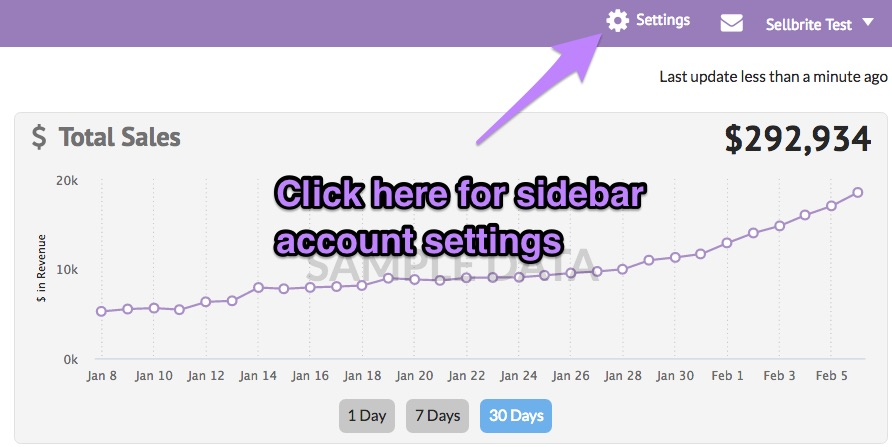
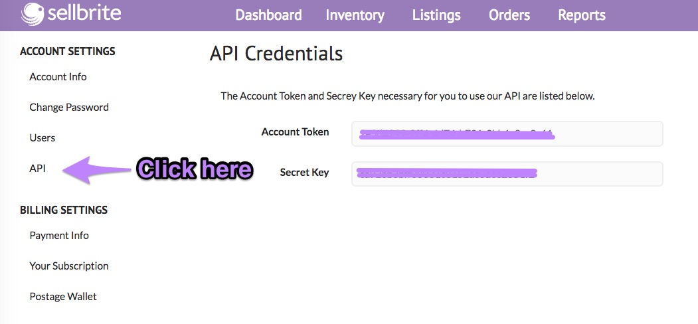

# Finding your API credentials

---

### Menu

[Getting Started with Sellbrite API](/Sellbrite-API)

[Test/Developer accounts](dev-accounts)

[Finding your API credentials](credentials)

[Authentication](authentication)

---

The Sellbrite API is currently only available on certain Sellbrite plans. [Visit our Pricing page](https://www.sellbrite.com/pricing-pro/) to see which plans include API access.

Once you have been given API access, click on the "Settings" tab in the top navigation of the Sellbrite app.



Then click on "API" to display your API credentials.



Please take note of both the API token and Secret Key as you will use these two values as the username and password respectively when making requests to the Sellbrite API. Here is a cURL example of making a request for all your orders:

``` cURL

curl --user auth_token:secret_key "https://api.sellbrite.com/v1/orders/7777"

```


Please see the [reference guides](reference/introduction) for more examples. If you need more support, please send any questions to [developer@sellbrite.com](mailto:developer@sellbrite.com)

